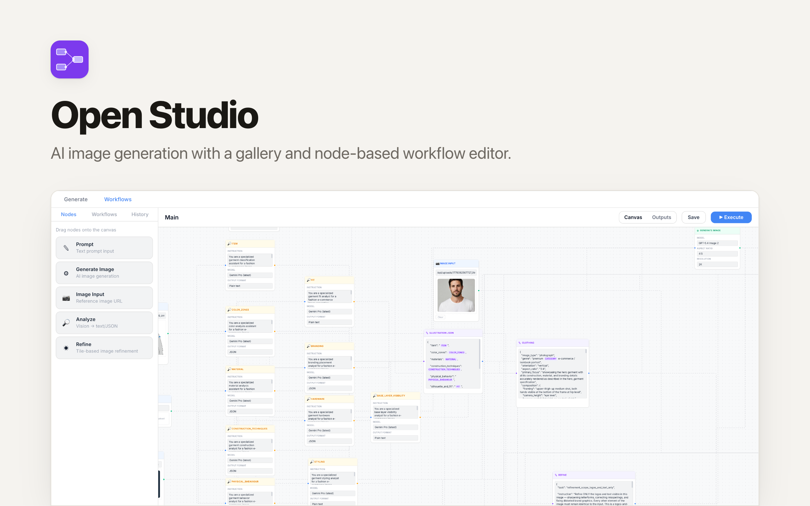

# Open Studio

A visual AI image generation studio with a justified gallery and node-based workflow editor. Built with **Preact + Tailwind CSS + Hono + D1**. Deploys to Cloudflare Workers via [Clawnify](https://clawnify.com).

## Features

- **Quick Generate** — prompt bar with model, aspect ratio, resolution, and batch count selectors
- **Justified gallery** — generated images displayed in a pixel-perfect justified layout preserving aspect ratios
- **Image-to-image** — drag a generated image or upload a file as source for the next generation
- **Node-based workflows** — React Flow editor for building reusable multi-step generation pipelines
- **Prompt variables** — type `/` in a prompt node to reference another prompt's content with `{{}}` syntax, rendered as inline pills
- **Auto-naming** — prompt nodes automatically get a descriptive title via Gemini 3.1 Flash Lite on blur
- **Editable titles** — double-click any node title to rename it
- **10+ models** — Gemini 3.1 Flash, Gemini 3 Pro, GPT Image 1, FLUX.2 Max, SeedDream 4.5, and more via OpenRouter
- **Generation history** — all generations persisted with prompt, model, and image
- **Dual-mode UI** — human-optimized + AI-agent-optimized (`?agent=true`)
- **Lightbox** — click any image to view full-size
- **Drag-to-reuse** — drag generated images into the prompt bar to use as input

## Quickstart

```bash
git clone https://github.com/clawnify/open-studio.git
cd open-studio
pnpm install
```

Create a `.dev.vars` file with your OpenRouter API key:

```
OPENROUTER_API_KEY=your-key-here
```

Start the dev server:

```bash
pnpm dev
```

Open `http://localhost:5173` in your browser. The database schema is applied automatically on startup.

### Agent Mode

Append `?agent=true` to the URL for an agent-friendly UI with always-visible delete buttons and large click targets.

## Tech Stack

| Layer | Technology |
|-------|-----------|
| **Frontend** | Preact, TypeScript, Tailwind CSS v4, Vite |
| **Node Editor** | React Flow (@xyflow/react) via Preact compat |
| **Backend** | Hono (Cloudflare Worker) |
| **Database** | D1 (SQLite at the edge) |
| **Storage** | R2 (file uploads) |
| **AI** | OpenRouter API (chat completions + image generation) |

### Prerequisites

- Node.js 20+
- pnpm
- [OpenRouter API key](https://openrouter.ai/keys)

## Architecture

```
schema.sql    — Canonical database schema (workflows, generations)
src/
  server/
    index.ts    — Hono API with D1 middleware
    db.ts       — D1-native database adapter
    uploads.ts  — R2 file storage adapter
  client/
    app.tsx           — Root component with Generate/Workflows tabs
    context.tsx       — Preact context for workflow state
    hooks/use-workflow.ts — Workflow state management + execution engine
    components/
      quick-generate.tsx  — Generation view with justified gallery
      workflow-canvas.tsx — React Flow canvas wrapper
      sidebar.tsx         — Node palette + workflow list + history
      toolbar.tsx         — Workflow name + save/execute buttons
      nodes/
        node-header.tsx       — Shared editable node header
        prompt-node.tsx       — Text prompt with / variable autocomplete
        generate-node.tsx     — AI image generation node
        image-input-node.tsx  — Reference image upload node
        output-node.tsx       — Result display node
```

### Schema & Migrations

`schema.sql` at the project root is the canonical database schema for fresh deployments. Edit it directly to add tables, columns, or indexes — this is the file maintainers own.

On a fresh deploy, Clawnify applies `schema.sql` to an empty D1 once and records a baseline hash in the deployed instance's tracking table. From then on, the deployed instance evolves via auto-generated migration files (Clawnify's app-builder agent authors them when the user asks for schema changes). Existing deployed instances are not retroactively migrated when this file changes — only new deploys pick up the updated baseline.

Inside a deployed instance, `schema.sql` becomes an auto-regenerated snapshot of the live D1 — do not hand-edit it there. In this template repo, you do edit it directly.

### API Endpoints

| Method | Endpoint | Description |
|--------|----------|-------------|
| GET | `/api/workflows` | List all workflows |
| POST | `/api/workflows` | Create a workflow |
| GET | `/api/workflows/:id` | Get a workflow |
| PUT | `/api/workflows/:id` | Update a workflow |
| DELETE | `/api/workflows/:id` | Delete a workflow |
| POST | `/api/generate` | Generate image via OpenRouter |
| GET | `/api/models` | List available image models |
| GET | `/api/generations/:workflowId` | List generations for a workflow |
| POST | `/api/generations` | Save a generation record |
| POST | `/api/suggest-name` | Auto-suggest a node title via Gemini |
| POST | `/api/uploads` | Upload an image file |
| GET | `/api/uploads/:filename` | Serve an uploaded image |

## Deploy

```bash
npx clawnify deploy
```

## License

MIT
